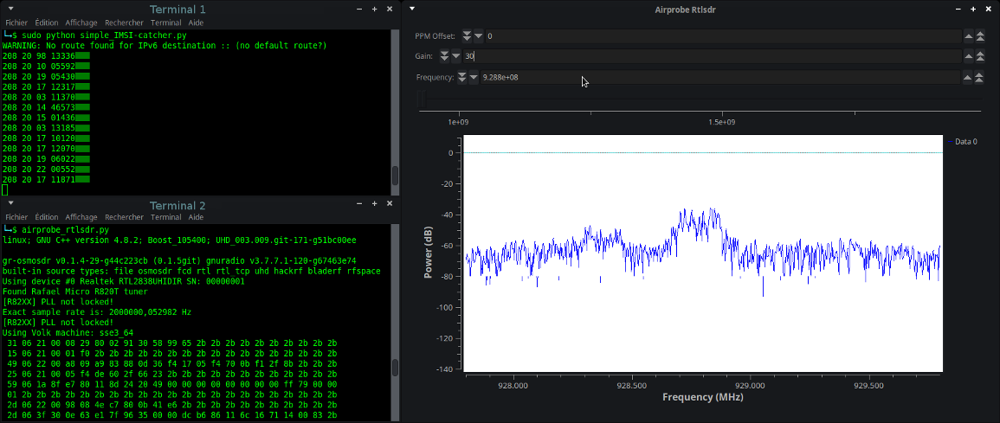

# IMSI-catcher
This program shows you IMSI numbers, country, brand and operator of cellphones around you.  
  
/!\ This program was made to understand how GSM network work. Not for bad hacking !  
  

  
  

## What you need

1 PC  
1 [USB DVB-T key (RTL2832U)](https://osmocom.org/projects/sdr/wiki/rtl-sdr) with antenna (less than 15$) or a [OsmocomBB phone](https://osmocom.org/projects/baseband/wiki/Phones)   or [HackRF](https://greatscottgadgets.com/hackrf/)  
  
  
## Setup

You have the choice with 2 types of install.  

### version 1 in your OS
```
git clone https://github.com/Oros42/IMSI-catcher.git
# or wget https://github.com/Oros42/IMSI-catcher/archive/master.zip && unzip -q master.zip

sudo apt install python3-numpy python3-scipy python3-scapy
```

#### gr-gsm for Ubuntu 20.04+
```
sudo apt-get install -y \
    cmake \
    autoconf \
    libtool \
    pkg-config \
    build-essential \
    python-docutils \
    libcppunit-dev \
    swig \
    doxygen \
    liblog4cpp5-dev \
    gnuradio-dev \
    gr-osmosdr \
    libosmocore-dev \
    liborc-0.4-dev

git clone -b maint-3.8 https://github.com/velichkov/gr-gsm.git
cd gr-gsm
mkdir build
cd build
cmake ..
make -j 4
sudo make install
sudo ldconfig
echo 'export PYTHONPATH=/usr/local/lib/python3/dist-packages/:$PYTHONPATH' >> ~/.bashrc
```

#### gr-gsm for Debian Testing (10) and Ubuntu 18.04+ :  
See https://osmocom.org/projects/gr-gsm/wiki/Installation#Installation-from-packages-on-Debian-Testing-and-Ubuntu-1804  
```
sudo apt-get install gr-gsm
wget http://git.osmocom.org/gr-gsm/plain/apps/grgsm_livemon.grc
grcc -d . grgsm_livemon.grc
mv grgsm_livemon.py grgsm_livemon
```

#### gr-gsm for older Debian and Ubuntu :  
```
sudo add-apt-repository -y ppa:ptrkrysik/gr-gsm
sudo apt update
sudo apt install gr-gsm
```
If gr-gsm failled to setup. Try this setup : https://github.com/ptrkrysik/gr-gsm/wiki/Installation  
Debian : https://tracker.debian.org/pkg/gr-gsm  


### version 2 with Docker

```bash
docker pull atomicpowerman/imsi-catcher
docker run -ti --net=host -e DISPLAY=$DISPLAY --privileged -v /dev/bus/usb:/dev/bus/usb  atomicpowerman/imsi-catcher bash
```


### setup mysql
=> tested on: macos
```
1. change .env.dist to .env
2. add detail mysql (MYSQL_HOST, MYSQL_USER, MYSQL_PASSWORD, MYSQL_DB) to .env
3. Sample DB: `db-example.sql`
4. install package: `python-decouple` and mysql client(`mysqlclient`)
5. run `python simple_IMSI-catcher.py --mysql --sniff`
```


## Run
  
### With version of gr-gsm < 0.41
  
Open 2 terminals.  
In terminal 1
```
sudo python3 simple_IMSI-catcher.py --sniff
```  
You can add -h to display options.  
  
In terminal 2, search a frequency to listen :
```
grgsm_scanner
```

Next, ask grgsm_livemon to use one of these frequencies:
```
grgsm_livemon -f <your_frequency>M
```
Example :  
```
grgsm_livemon -f 938.2M
```

It should start producing output like :
```
15 06 21 00 01 f0 2b 2b 2b 2b 2b 2b 2b 2b 2b 2b 2b 2b 2b 2b 2b 2b 2b
25 06 21 00 05 f4 f8 68 03 26 23 2b 2b 2b 2b 2b 2b 2b 2b 2b 2b 2b 2b
49 06 1b 95 cc 02 f8 02 01 9c c8 03 1e 57 a5 01 79 00 00 1c 13 2b 2b
...
```
You can change the frequency if you want.  

### With version of gr-gsm >= 0.41.2-1

Open 2 terminals.  
In terminal 1
```
python3 simple_IMSI-catcher.py
```  
You can add -h to display options.  


In terminal 2

```
python scan-and-livemon
```

This step can take a few minutes to get started, as it first run
grgsm_scanner to find nearby base stations and ask
grgsm_livemon_headless to receive the signal from the strongest
signals.

Or first find the frequencies of the nearby base stations.

```
grgsm_scanner
```

Next, ask grgsm_livemon to use one of these frequencies:

```
grgsm_livemon -f <your_frequency>M
```
Example :  
```
grgsm_livemon -f 938.2M
```

It should start producing output like :
```
15 06 21 00 01 f0 2b 2b 2b 2b 2b 2b 2b 2b 2b 2b 2b 2b 2b 2b 2b 2b 2b
25 06 21 00 05 f4 f8 68 03 26 23 2b 2b 2b 2b 2b 2b 2b 2b 2b 2b 2b 2b
49 06 1b 95 cc 02 f8 02 01 9c c8 03 1e 57 a5 01 79 00 00 1c 13 2b 2b
...
```

You can change the frequency if you want.

### For all


Now, watch terminal 1 and wait. IMSI numbers should appear :-)  
If nothing appears after 1 min, change the frequency.  
  
Doc : https://fr.wikipedia.org/wiki/Global_System_for_Mobile_Communications  
Example of frequency in France : 9.288e+08 Bouygues  
  
You can watch GSM packets with  
```
sudo wireshark -k -Y '!icmp && gsmtap' -i lo
```

## Optional
 
Get immediate assignment :  
```
sudo python immediate_assignment_catcher.py
```

Find frequencies
----------------

You can either use the grgsm_scanner program from gr-gsm mentioned
above, or fetch the kalibrate-hackrf tool like this:

```
sudo apt-get install automake autoconf libhackrf-dev
git clone https://github.com/scateu/kalibrate-hackrf
cd kalibrate-hackrf/
./bootstrap
./configure
make
sudo make install
```
Run  
```
kal -s GSM900
```
```
kal: Scanning for GSM-900 base stations.
GSM-900:
	chan:   14 (937.8MHz + 10.449kHz)	power: 3327428.82
	chan:   15 (938.0MHz + 4.662kHz)	power: 3190712.41
...
```
  
# Links

Setup of Gr-Gsm : https://github.com/ptrkrysik/gr-gsm/wiki/Installation  
Frequency : http://www.worldtimezone.com/gsm.html and https://fr.wikipedia.org/wiki/Global_System_for_Mobile_Communications  
Mobile Network Code : https://en.wikipedia.org/wiki/Mobile_Network_Code  
Scapy : http://secdev.org/projects/scapy/doc/usage.html  
IMSI : https://fr.wikipedia.org/wiki/IMSI  
Realtek RTL2832U : https://osmocom.org/projects/sdr/wiki/rtl-sdr and http://doc.ubuntu-fr.org/rtl2832u and http://doc.ubuntu-fr.org/rtl-sdr  
